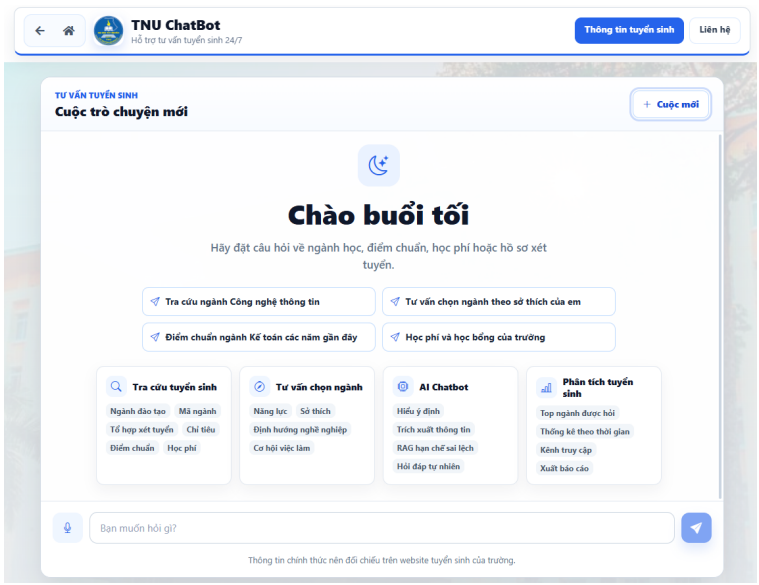
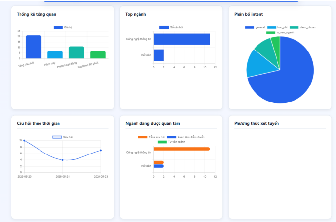

<div align="center">

# TNU Admission Chatbot

[](https://laravel.com)
[](https://react.dev)
[](https://php.net)
[](https://mysql.com)

**AI-powered admission consulting chatbot for Trường Đại học Công nghệ - TNU**

Hỗ trợ tư vấn tuyển sinh tự động với trí tuệ nhân tạo, tích hợp dữ liệu admission, phân tích ý định câu hỏi, và quản lý analytics toàn diện.

[Demo](#) • [Tài liệu](#) • [Bắt đầu](#) • [API](#) • [Triển khai](#)

</div>

---

## Giao diện ứng dụng

<div align="center">
  <h3>Chatbot Interface</h3>
  
  <p><em>Giao diện chat thân thiện với gợi ý FAQ tự động</em></p>
</div>

<div align="center">
  <h3>Admin Dashboard</h3>
  
  <p><em>Bảng điều khiển quản lý với thống kê analytics</em></p>
</div>

---

## Tính năng chính

| Tính năng | Tên | Mô tả |
|---|---|---|
| AI | Chatbot AI | Trả lời câu hỏi admission tự động bằng Google Gemini |
| Database | Knowledge Base | Cơ sở dữ liệu admission được cấu trúc và bình thường hoá |
| Search | Semantic Search | Tìm kiếm semantic với embedding vectors và RAG |
| Analytics | Analytics | Theo dõi câu hỏi, ý định, chuyên ngành được hỏi nhiều nhất |
| Admin | Admin Panel | Quản lý kiến thức, dữ liệu chuyên ngành, FAQ và logs |
| Performance | Cache System | Lưu cache câu trả lời để tăng hiệu suất |
| UI | Responsive UI | Giao diện React hoàn toàn responsive trên tất cả thiết bị |

---

## Kiến trúc hệ thống

```
┌─────────────────────────────────────────────────────────────┐
│                     Frontend (React)                         │
│              Chat UI • Analytics Views • Admin Panel         │
└──────────────────────┬──────────────────────────────────────┘
                       │
                  HTTP API / REST
                       │
┌──────────────────────▼──────────────────────────────────────┐
│                   Backend (Laravel)                          │
├──────────────────────────────────────────────────────────────┤
│  Controllers │ Services │ Models │ Migrations │ Commands     │
├──────────────────────────────────────────────────────────────┤
│  • AI Chat Service (Gemini Integration)                      │
│  • Question Analyzer (Intent Detection)                      │
│  • Embedding Service (Vector Search)                         │
│  • Knowledge Search (RAG)                                    │
│  • Analytics Service (Logging & Metrics)                     │
└──────────────────────┬──────────────────────────────────────┘
                       │
┌──────────────────────▼──────────────────────────────────────┐
│                   Database (MySQL)                           │
├──────────────────────────────────────────────────────────────┤
│  chat_logs • knowledge_bases • admission_majors • faq...     │
└──────────────────────────────────────────────────────────────┘
```

---

## Cấu trúc thư mục

```
LTUDMNM/
├── backend/                    # Laravel API & Services
│   ├── app/
│   │   ├── Models/            # Database models
│   │   ├── Services/          # Business logic (AI, Search, Analytics)
│   │   ├── Http/Controllers/  # API endpoints
│   │   └── Console/Commands/  # Artisan commands
│   ├── config/                # Configuration files
│   ├── database/
│   │   ├── migrations/        # Schema migrations
│   │   └── seeders/           # Database seeders
│   ├── routes/                # API routes
│   └── tests/                 # Unit & Feature tests
│
├── frontend/                  # React Chatbot UI
│   ├── public/               # Static assets
│   ├── src/
│   │   ├── components/       # React components
│   │   ├── contexts/         # Context API
│   │   └── ttn_data/         # Admission data
│   └── package.json
│
└── run.bat                    # Quick start script for Windows
```

---

## Quick Start

### Yêu cầu hệ thống
- PHP 8.2 trở lên
- Node.js 18+ & npm 9+
- MySQL 8.0+
- Composer 2.0+

### 1. Cài đặt Backend

```bash
cd backend

# Cài đặt dependencies
composer install

# Tạo file .env
cp .env.example .env

# Tạo encryption key
php artisan key:generate

# Chạy migrations
php artisan migrate

# Seed dữ liệu (tùy chọn)
php artisan db:seed

# Khởi động server
php artisan serve
```

**Backend sẽ chạy tại:** `http://localhost:8000`

### 2. Cài đặt Frontend

```bash
cd frontend

# Cài đặt dependencies
npm install

# Tạo file .env (tùy chọn)
cp .env.example .env

# Khởi động development server
npm start
```

**Frontend sẽ chạy tại:** `http://localhost:3000`

### 3. Cài đặt một bước (Windows)

```bash
./run.bat
```

---

## Cấu hình Environment

### Backend Environment Variables (.env)

**Gemini AI Configuration:**
```env
GEMINI_API_KEY=your_api_key_here
GEMINI_MODEL=gemini-2.5-flash              # Model version
GEMINI_TIMEOUT=60                          # Request timeout (seconds)
GEMINI_TEMPERATURE=0.2                     # Response creativity (0-1)
GEMINI_TOP_P=0.8                          # Nucleus sampling
GEMINI_TOP_K=40                           # Top-K sampling
```

**Embedding & Vector Search:**
```env
AI_ENABLE_EMBEDDING_SEARCH=false           # Enable semantic search
GEMINI_EMBEDDING_MODEL=gemini-embedding-001
EMBEDDING_LOCAL_PREFILTER_LIMIT=200        # Pre-filter limit
VECTOR_STORE_DRIVER=local                  # local|qdrant|faiss|pgvector
```

**Cache Configuration:**
```env
CHAT_CACHE_TTL_SECONDS=3600                # Cache TTL (1 hour)
```

**Admin Configuration:**
```env
ADMIN_API_AUTH=true                        # Enable API authentication
ADMIN_NAME=Administrator
ADMIN_EMAIL=admin@example.com
ADMIN_PASSWORD=admin123456
```

**🔒 Production Notes:**
- Đặt `APP_DEBUG=false` 
- Bật `ADMIN_API_AUTH=true`
- Bảo vệ routes: Dashboard, Chat logs, Export
- Sử dụng environment variables an toàn

### Frontend Environment Variables (.env)

```env
REACT_APP_API_URL=http://127.0.0.1:8000/api    # Backend API URL
```

---

## Artisan Commands

### Import & Data Management

```bash
# Import admission knowledge từ JSON
php artisan knowledge:import ../frontend/src/ttn_data/ttn_all_data.json

# Import admission knowledge từ PDF extracted
php artisan import:pdf-extracted ../frontend/src/ttn_data/pdf_extracted.json

# Bình thường hoá dữ liệu chuyên ngành (với năm admission)
php artisan admission:majors-normalize --year=2026

# Tạo embeddings cho kiến thức (semantic search)
php artisan embedding:knowledge --limit=100

# Tạo FAQ suggestions tự động
php artisan faq:generate --limit=50

# Seed database với dữ liệu mẫu
php artisan db:seed

# Chạy unit tests
php artisan test
```

### Các lệnh đặc biệt

**Fix admission_majors nếu có nested JSON strings:**
```bash
php artisan admission:majors-normalize --year=2025 --fix-nested
```

**Xóa cache:**
```bash
php artisan cache:clear
php artisan config:clear
```

---

## API Documentation

### Authentication API

| Method | Endpoint | Mô tả |
|--------|----------|-------|
| `POST` | `/api/login` | Đăng nhập admin, nhận Sanctum token |
| `GET` | `/api/me` | Lấy profile admin hiện tại |
| `POST` | `/api/logout` | Đăng xuất (revoke token) |
| `POST` | `/api/register` | Tạo tài khoản admin mới |
| `GET` | `/api/health` | Health check backend |

### Chatbot API

| Method | Endpoint | Mô tả |
|--------|----------|-------|
| `POST` | `/api/chat` | Gửi câu hỏi đến chatbot |
| `GET` | `/api/faq-questions` | Lấy danh sách FAQ gợi ý |

**Request Example:**
```json
{
  "message": "Ngành công nghệ thông tin có điểm chuẩn bao nhiêu?",
  "platform": "web",
  "history": []
}
```

### Admin CMS API

| Method | Endpoint | Mô tả |
|--------|----------|-------|
| `CRUD` | `/api/knowledge-bases` | Quản lý knowledge base (RAG) |
| `CRUD` | `/api/admission-majors` | Quản lý dữ liệu chuyên ngành |

**🔒 Yêu cầu authentication:** Admin token (Sanctum)

### Analytics & Dashboard API

| Method | Endpoint | Mô tả |
|--------|----------|-------|
| `GET` | `/api/chat-logs` | Lấy danh sách chat logs |
| `GET` | `/api/chat-logs/{id}` | Chi tiết một chat log |
| `DELETE` | `/api/chat-logs/{id}` | Xóa chat log |
| `GET` | `/api/dashboard/overview` | Tổng quan dashboard |
| `GET` | `/api/dashboard/top-majors` | Chuyên ngành được hỏi nhiều nhất |
| `GET` | `/api/dashboard/questions-by-intent` | Thống kê theo ý định |
| `GET` | `/api/dashboard/questions-by-day` | Thống kê theo ngày |

**🔒 Yêu cầu authentication:** Admin token

---

## Chatbot Flow (Luồng hoạt động)

```
┌──────────────────────────────────────────────────────────────┐
│  1. User gửi message từ React                                │
│     {message, platform, history} → /api/chat                 │
└─────────────────────────┬──────────────────────────────────┘
                          │
┌─────────────────────────▼──────────────────────────────────┐
│  2. Backend Analyze Request                                 │
│     - Phân tích ý định (Intent)                             │
│     - Detect chuyên ngành (Major)                           │
│     - Xác định năm admission (Year)                         │
│     - Phân loại câu hỏi (Category)                          │
└─────────────────────────┬──────────────────────────────────┘
                          │
┌─────────────────────────▼──────────────────────────────────┐
│  3. Context Retrieval (RAG)                                 │
│     - Lấy dữ liệu từ admission_majors                       │
│     - Lấy kiến thức từ knowledge_bases                      │
│     - [Optional] Embedding search nếu enabled              │
└─────────────────────────┬──────────────────────────────────┘
                          │
┌─────────────────────────▼──────────────────────────────────┐
│  4. Gemini API Call                                         │
│     System Prompt + Context + History + Question            │
│     → Gemini API → AI Response                              │
└─────────────────────────┬──────────────────────────────────┘
                          │
┌─────────────────────────▼──────────────────────────────────┐
│  5. Store & Log                                             │
│     - Lưu interaction vào chat_logs                         │
│     - Cache response (TTL: 3600s)                           │
│     - Update analytics                                      │
└─────────────────────────┬──────────────────────────────────┘
                          │
┌─────────────────────────▼──────────────────────────────────┐
│  6. Return to Frontend                                      │
│     - Response answer                                       │
│     - Fetch FAQ suggestions                                 │
│     - Render UI                                             │
└──────────────────────────────────────────────────────────────┘
```

### Embedding & Vector Search (Optional)

Khi `AI_ENABLE_EMBEDDING_SEARCH=true`:

1. **Local Mode** (mặc định):
   - Pre-filter: Lọc top `EMBEDDING_LOCAL_PREFILTER_LIMIT` items
   - Scoring: Tính cosine similarity bằng PHP

2. **Advanced (Production)**:
   - Qdrant: Dedicated vector database
   - FAISS: Facebook AI Similarity Search
   - pgvector: PostgreSQL extension
   - Chỉnh `VECTOR_STORE_DRIVER` trong `.env`

---

## Database Schema

### Main Tables

#### `chat_logs`
Lưu trữ tất cả interactions từ chatbot
- `id`, `user_id`, `message`, `answer`
- `intent`, `major`, `category`, `year`
- `source`, `platform`, `response_time`
- `created_at`, `updated_at`

#### `knowledge_bases`
Knowledge chunks cho RAG (Retrieval-Augmented Generation)
- `id`, `title`, `content`, `chunk_text`
- `source_url`, `source_type` (website/pdf)
- `embedding` (vector - optional)
- `metadata` (JSON - tags, category)
- `is_active`, `created_at`

#### `admission_majors`
Dữ liệu chuyên ngành đã bình thường hoá
- `id`, `code`, `name`, `year`
- `subject_groups` (JSON)
- `scores` (JSON - điểm chuẩn)
- `quota`, `tuition`, `location`
- `description`, `created_at`

#### `faq_questions`
FAQ suggestions được tạo tự động
- `id`, `question`, `answer`
- `major_id`, `category`, `priority`
- `is_active`, `created_at`

---

## System Requirements

### Sản xuất (Production)

| Component | Version | Yêu cầu |
|-----------|---------|---------|
| PHP | 8.2+ | Cần extensions: intl, mbstring, openssl, pdo_mysql, tokenizer, xml, ctype, json, fileinfo |
| Laravel | 11.x | Framework core |
| Node.js | 18+ | Frontend build |
| MySQL | 8.0+ | Database server |
| Google Gemini API | Latest | AI engine |

### Phát triển (Development)

```bash
# Windows - Sử dụng run.bat
./run.bat

# Linux/Mac - Manual setup
php artisan serve &
cd frontend && npm start
```

---

## Security Best Practices

### Authentication
- Sử dụng Laravel Sanctum cho API token  
- Bật `ADMIN_API_AUTH=true` trong production  
- Implement CORS chặt chẽ  

### Data Protection
- Mã hoá sensitive data trong database  
- Validate & sanitize tất cả user input  
- Sử dụng HTTPS trong production  

### Rate Limiting
- Giới hạn request per IP  
- Giới hạn API calls đến Gemini  

### Deployment
- Không expose `.env` files  
- Sử dụng environment variables  
- Regular backup database  
- Monitor logs & errors  

---

## Deployment Guide

### Docker Setup (Tương lai)

```dockerfile
# Dockerfile cho Laravel + MySQL
# TODO: Thêm Docker configuration
```

### Manual Server Deployment

1. **Clone repository**
   ```bash
   git clone <repo> /var/www/app
   cd /var/www/app
   ```

2. **Backend setup**
   ```bash
   cd backend
   composer install --no-dev
   cp .env.example .env
   php artisan key:generate
   php artisan migrate --force
   php artisan config:cache
   ```

3. **Frontend build**
   ```bash
   cd frontend
   npm install
   npm run build
   ```

4. **Web server (Nginx)**
   ```nginx
   server {
       listen 80;
       server_name your-domain.com;
       
       root /var/www/app/backend/public;
       index index.php;
       
       location ~ \.php$ {
           fastcgi_pass php-fpm;
           fastcgi_index index.php;
       }
   }
   ```

---

## Testing

```bash
# Unit tests
php artisan test

# Test specific feature
php artisan test --filter=ChatTest

# With coverage report
php artisan test --coverage
```

---

## Documentation Structure

```
docs/
├── API.md              # Chi tiết API endpoints
├── ARCHITECTURE.md     # Kiến trúc chi tiết
├── DEPLOYMENT.md       # Hướng dẫn triển khai
├── TROUBLESHOOTING.md  # Khắc phục sự cố
└── images/             # Screenshots & diagrams
    ├── chat-interface.png
    ├── admin-dashboard.png
    └── architecture-diagram.png
```

---

## Troubleshooting

### Backend Issues

**"SQLSTATE[HY000]: General error"**
```bash
# Reset database
php artisan migrate:reset
php artisan migrate

# Hoặc xóa và tạo lại
php artisan db:wipe
php artisan migrate --seed
```

**Gemini API không hoạt động**
- Kiểm tra `GEMINI_API_KEY` trong `.env`
- Kiểm tra quota API
- Xem logs: `storage/logs/laravel.log`

**Embedding search không chính xác**
- Đảm bảo `AI_ENABLE_EMBEDDING_SEARCH=true`
- Re-run embedding command:
  ```bash
  php artisan embedding:knowledge --limit=100
  ```

### Frontend Issues

**CORS error khi call API**
```bash
# Backend không chạy hoặc API URL sai
# Kiểm tra .env: REACT_APP_API_URL
# Default: http://127.0.0.1:8000/api
```

**npm install fails**
```bash
# Clear cache & retry
npm cache clean --force
rm -rf node_modules package-lock.json
npm install
```

---

## Support & Contribution

### Báo cáo Issues
- Tạo issue trên GitHub với:
  - Description chi tiết
  - Steps to reproduce
  - Expected vs actual behavior
  - Environment info

### Contribute
1. Fork repository
2. Create feature branch (`git checkout -b feature/amazing-feature`)
3. Commit changes (`git commit -m 'Add amazing feature'`)
4. Push to branch (`git push origin feature/amazing-feature`)
5. Open Pull Request

---

## License

Dự án này được cấp phép dưới MIT License - xem file [LICENSE](LICENSE) để biết chi tiết.

---

## Team

- **Frontend Lead:** React Team
- **Backend Lead:** Laravel Team
- **AI Integration:** Gemini API Specialist
- **DevOps:** Infrastructure Team

---

<div align="center">

**Made with care for TNU Admission Support**

[Về đầu trang](#tnu-admission-chatbot)

</div>
